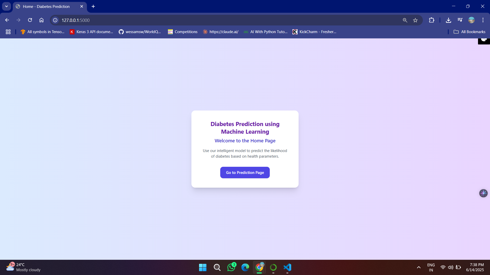
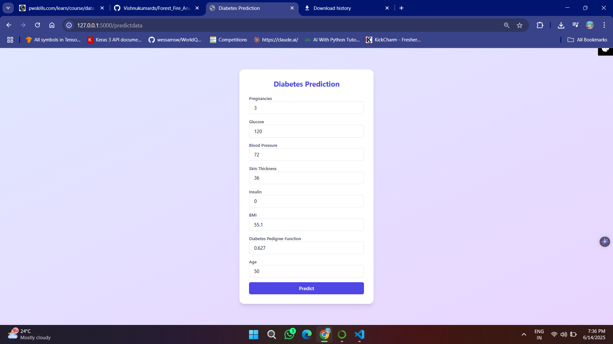
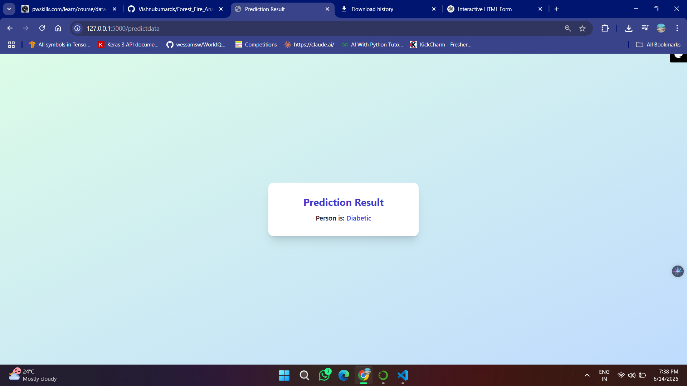

# 🩺 Diabetes Prediction using Machine Learning

This project is a web-based application that predicts whether a person is likely to have diabetes based on medical parameters. It leverages a trained machine learning model and provides a user-friendly interface built with Flask and Tailwind CSS.

---

## 🧠 Features

- 💻 Web interface for entering medical parameters
- 📊 Predicts diabetes using a trained ML model
- 🌐 Flask-based backend
- 🎨 Clean and modern UI with Tailwind CSS
- ⚙️ Lightweight and fast
---

# 🧩 Challenges Faced & How We Overcame Them
During the development of this diabetes prediction project, we encountered several challenges. Here's a summary of the obstacles and how we resolved them:

1. ⚠️ Poor Initial Model Performance
Issue: Initially, our Logistic Regression model yielded poor accuracy.

Cause: After analysis, we found that the dataset was not well-scaled and had imbalanced feature ranges, which affected model training.

Solution: We applied feature scaling techniques (like StandardScaler) to normalize the input data. This significantly improved the model’s performance.

2. 🔧 Model Optimization
Issue: Choosing the best configuration for Logistic Regression was tricky.

Solution: We performed hyperparameter tuning using techniques such as Grid Search and Cross Validation to find the optimal set of parameters.

3. 🧪 Regularization Technique Selection
Issue: Overfitting and underfitting needed to be balanced.

Solution: We tested different regularization techniques (L1 and L2) and found that L2 Regularization (Ridge) performed the best in reducing overfitting while maintaining accuracy.

4. 📊 Model Selection Confidence
We experimented with multiple configurations and hyperparameters before finalizing Logistic Regression with L2 Regularization as the most reliable model for this dataset.
---

## 📸 Screenshots

### Home Page

### Prediction Form

### Result Display

---

## 🔧 Tech Stack

- **Frontend**: HTML, Tailwind CSS
- **Backend**: Python, Flask
- **ML Model**: Scikit-learn (e.g., RandomForest, Logistic Regression, etc.)

---
